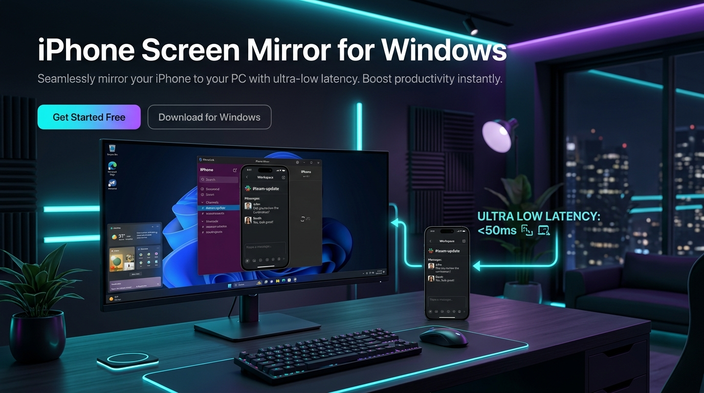
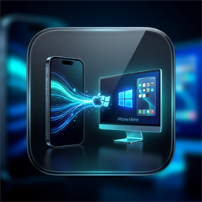
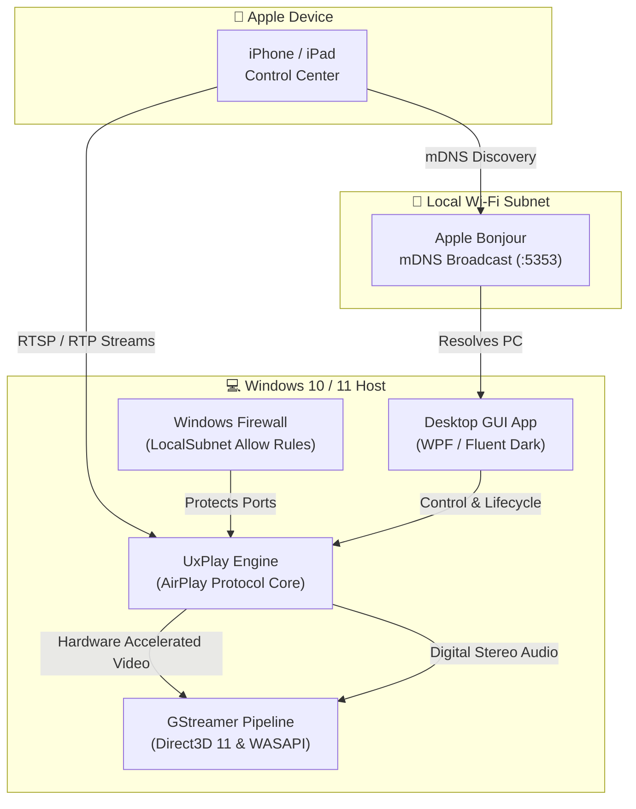

<div align="center">

  

  <br/><br/>

  <p align="center">
    
  </p>

  # iPhone Screen Mirror for Windows
  ### Wireless • Zero-Latency • Native AirPlay Receiver for Windows 10 & 11

  <p align="center">
    <b>Transform your Windows PC into a studio-grade Apple AirPlay display.</b><br/>
    No iPhone apps. No third-party subscriptions. No cables. Just seamless 60 FPS mirroring.
  </p>

  <p align="center">
    <a href="https://github.com/shreyanshucodes/screen-mirroring-iphone-windows/releases"></a>
    <a href="#-quick-start-3-steps"></a>
    <a href="https://github.com/shreyanshucodes/screen-mirroring-iphone-windows/stargazers"></a>
  </p>

  <p align="center">
    
    
    
    
    
    
    
  </p>

</div>

---

## 🌟 Why iPhone Screen Mirror?

Commercial screen mirroring tools for Windows are bloated, charge expensive yearly subscriptions, demand sketchy companion apps on your iPhone, or introduce laggy cloud relays. 

**iPhone Screen Mirror for Windows** gives you a **native, standalone desktop receiver** powered by hardware-accelerated Direct3D 11 rendering and high-fidelity Apple Bonjour mDNS discovery.

```
┌─────────────────┐       Wi-Fi (AirPlay)       ┌────────────────────────┐
│   Apple iPhone  │ ──────────────────────────► │  Windows 10 / 11 PC    │
│ (Control Center)│    1080p @ 60 FPS • <50ms   │  (D3D11 / WASAPI Audio)│
└─────────────────┘                             └────────────────────────┘
```

---

## ✨ Features That Stand Out

| Feature | Description |
| :--- | :--- |
| ⚡ **<50ms Low Latency** | Optimized streaming pipeline tailored for interactive mobile app demos, gaming, and real-time workflows. |
| 🎨 **Modern Desktop GUI** | Sleek Apple tvOS & Windows 11 dark glass interface. No need to memorize terminal commands. |
| 📱 **Zero iPhone App Needed** | Connects natively using iOS **Control Center ➔ Screen Mirroring**. Works with any iPhone or iPad. |
| 🎧 **Full Digital Audio** | Real-time stereo audio routed directly to your PC speakers, headphones, or virtual audio cables via WASAPI. |
| 🔒 **PIN Pairing Protection** | Enforce a 4-digit security PIN displayed on your PC screen so roommates or coworkers can't accidentally beam to your display. |
| 💼 **Zoom & Teams Safe-Share** | One-click OpenGL fallback (`-ShareSafe`) ensures your mirror never turns into a black rectangle when window-sharing on Microsoft Teams, Zoom, or OBS. |
| 🎬 **A/V Sync Mode** | Dedicated mode prioritizing lip-sync buffer alignment for watching movies and media playback. |
| 🖥️ **Desktop Shortcut Generator** | Pin a clean, branded **"iPhone Mirror for Windows"** icon straight to your desktop in one click. |

---

## 🚀 Quick Start (3 Steps)

### Step 1: Pre-requisites
Make sure **Apple Bonjour** is running on your PC (this enables your PC to be discovered wirelessly).
* If you have **iTunes** or **Apple Devices** installed, you already have it!
* Otherwise, grab the official [Apple Bonjour Print Services for Windows](https://support.apple.com/kb/DL999).

### Step 2: One-Time Firewall Setup
Open PowerShell as Administrator in the repository folder and run:
```powershell
Set-ExecutionPolicy -Scope Process Bypass
.\setup.ps1
```
*(This automatically installs the verified UxPlay 1.x receiver engine and configures Windows Firewall so incoming AirPlay packets are allowed).*

### Step 3: Launch & Mirror!
You have three effortless ways to start:
* 🌟 **Desktop Shortcut:** Double-click **`iPhone Mirror for Windows`** on your Desktop.
* ⚡ **Zero-Console Launcher:** Double-click **`Launch-iPhone-Mirror.vbs`** (opens with zero black console flashing).
* 💻 **Quick CMD:** Double-click **`Launch-iPhone-Mirror.cmd`**.

Then on your iPhone:
1. Swipe down from the top-right corner to open **Control Center**.
2. Tap **Screen Mirroring** (two overlapping rectangles).
3. Select your PC name from the list. **Enjoy your mirror!**

---

## 📊 Comparison Matrix

| Capability | **iPhone Screen Mirror for Windows** | Commercial SaaS (AirServer / Reflector) | Lightning / USB-C Cable |
| :--- | :---: | :---: | :---: |
| **Price** | **100% Free & Open-Source** | $20 - $40 / year | $29+ hardware cable |
| **iOS Companion App** | **None (Native AirPlay)** | Often requires helper app | Requires iTunes / drivers |
| **Wireless Freedom** | **Yes (Local Wi-Fi)** | Yes | ❌ Tethered to desk |
| **Framerate** | **Up to 60 FPS** | 30 - 60 FPS (Tier-locked) | 60 FPS |
| **Audio Passthrough** | **Included (WASAPI)** | Included | Sometimes muted |
| **Data Privacy** | **100% Local (Zero Telemetry)** | Cloud Telemetry / Licensing servers | Local |
| **Presentation Safe Mode** | **Built-in (Teams/Zoom safe)** | Hit-or-miss capture | Captures entire desktop |

---

## 🎛️ Power User Modes (CLI)

For streamers, classroom setups, and automated kiosks, the engine can be driven with advanced command-line arguments:

```powershell
# 🏆 Presentation Mode (Custom name, PIN security, Fullscreen)
.\Screen Mirroring for iPhone in Windows\Mirror-iPhone.ps1 -Name "Executive Boardroom" -PIN -Fullscreen

# 🎬 Cinema Sync Mode (Optimized buffer lip-sync for video streaming)
.\Screen Mirroring for iPhone in Windows\Mirror-iPhone.ps1 -Sync

# ⚡ Low Bandwidth / Network-Saving Mode (Capped at 30 FPS)
.\Screen Mirroring for iPhone in Windows\Mirror-iPhone.ps1 -Fps 30

# 🎥 Video Conference Safe Mode (OBS, Teams, and Zoom capture friendly)
.\Screen Mirroring for iPhone in Windows\Mirror-iPhone.ps1 -ShareSafe

# 🔇 Silent Display Mode (Mute PC audio output)
.\Screen Mirroring for iPhone in Windows\Mirror-iPhone.ps1 -NoAudio
```

### ⌨️ In-Session Hotkeys
* **`Alt + Enter`** — Toggle fullscreen mode.
* **`Ctrl + C`** — Stop receiver session and close.

---

## 🛠️ Diagnostics & Self-Healing

If your PC isn't showing up on your iPhone's Screen Mirroring menu:

1. **Both devices on the same Wi-Fi:** Ensure your iPhone is not on Cellular or a guest network with client isolation enabled.
2. **Run Built-in Diagnostics:**
   ```powershell
   .\doctor.ps1
   ```
   Or click **"Diagnostics"** in the Desktop GUI. It inspects:
   * Apple Bonjour service status & UDP 5353 listener
   * Windows Firewall rule validity
   * Network interface metrics and IP routing
3. **Black Screen on Teams / Zoom:** Run with `-ShareSafe` or toggle "Safe Share" in the GUI.

---

## 🏗️ Architecture



---

## 📜 Credits & Acknowledgments

This project is built with deep appreciation for the open-source multimedia and reverse-engineering community:
* **[UxPlay](https://github.com/FDH2/UxPlay)** by FDH2 — The foundational open-source AirPlay mirror server (GPLv3).
* **[leapbtw/uxplay-windows](https://github.com/leapbtw/uxplay-windows)** — Pioneering Windows binary compilation and packaging.
* **[AirPlayPC](https://github.com/gbulog/pcairplay)** — Windows integration architecture and diagnostics.

---

## 📄 License

The launcher, GUI wrapper, and automation scripts are distributed under the [MIT License](LICENSE). Third-party components and engines retain their respective upstream licenses (GPLv3 / Apple Bonjour SDK).

<div align="center">
  <sub>Built with ❤️ by <a href="https://github.com/shreyanshucodes">Shreyanshu Srivastava</a> for creators, educators, and power users.</sub>
</div>
